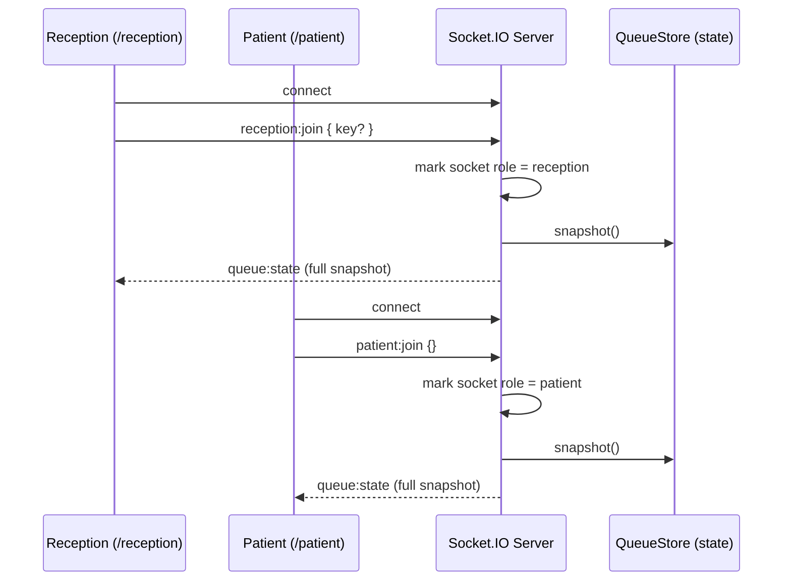
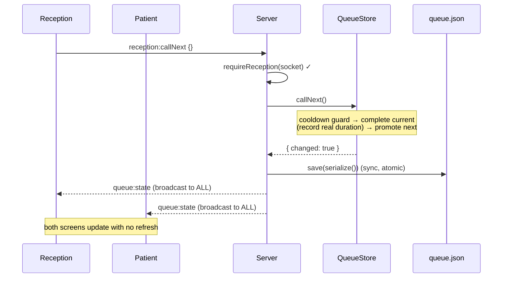
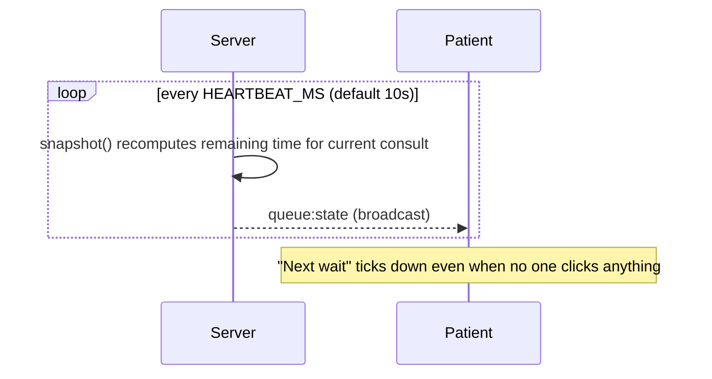
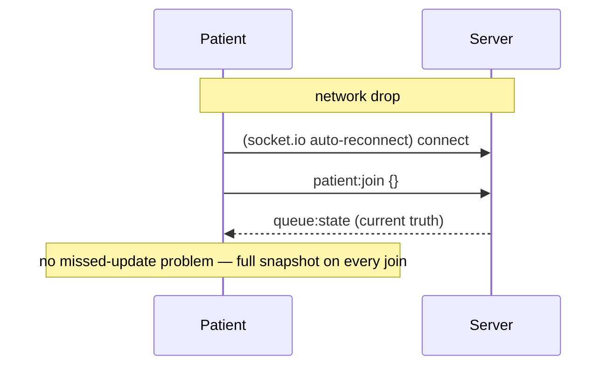

# Socket Event Diagram — Queue Cure '26

All real-time sync flows through Socket.IO. The server holds the single source of truth
and pushes a full `queue:state` snapshot to every client on any change. Clients never
mutate local state directly — they render whatever the latest snapshot says.

## 1. Connection & join (both screens)



## 2. Call Next — the core live-sync flow (40% criterion)



## 3. Guarded / rejected actions

```mermaid
sequenceDiagram
    participant P as Patient (read-only)
    participant R as Reception
    participant S as Server
    participant Q as QueueStore

    P->>S: reception:callNext {}
    S->>S: requireReception(socket) ✗
    S-->>P: queue:notice { type: error, "Not authorized..." }

    R->>S: reception:callNext {}  (queue empty)
    S->>Q: callNext()
    Q-->>S: { changed: false, notice: "No patients waiting" }
    S-->>R: queue:notice (only the actor; no broadcast)

    R->>S: reception:callNext {}  (within cooldown)
    S->>Q: callNext()
    Q-->>S: { changed: false, notice: "Ignored rapid Call Next" }
    S-->>R: queue:notice
```

## 4. Heartbeat — keeps wait estimates fresh (25% criterion)



## 5. Reconnect resync



## Event reference

**Client → Server:** `reception:join`, `patient:join`, `reception:addPatient`,
`reception:callNext`, `reception:completeCurrent`, `reception:setAvgTime`,
`reception:undo`

**Server → Client:** `queue:state` (full snapshot), `queue:notice` (`{type, message}`)

### Why full-snapshot broadcast (not granular deltas)?

A single `queue:state` event carrying the entire state is simpler and strictly more
robust than emitting granular deltas (`patientAdded`, `tokenCalled`, …):

- **No client-side reconciliation** and no possibility of drift between screens.
- **Reconnect is free** — the same snapshot that powers live updates also resyncs a
  client that just reconnected.
- Snapshots are tiny (a clinic queue is tens of entries), so bandwidth is a non-issue.
